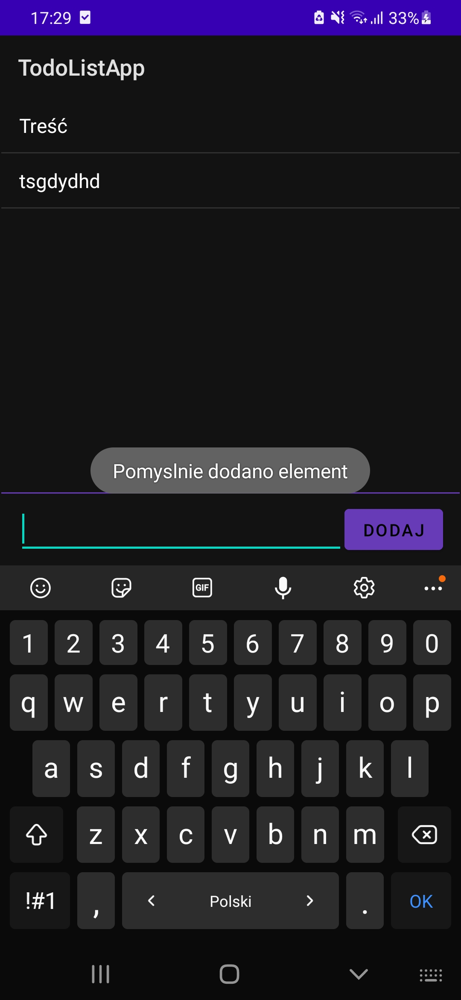
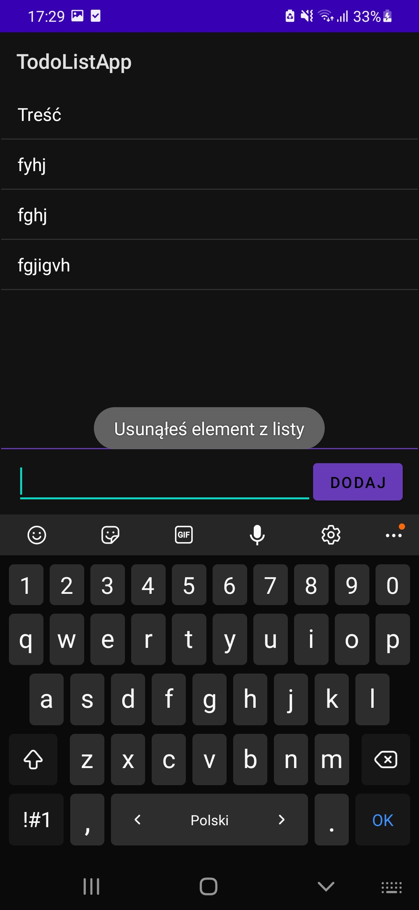

# Zadanie Android Studio Kacper Poneta 4P

## Opis

Przedstawiam aplikacje `ToDoList`, powyżej można zobaczyć jej kod zródłowy. Po włączeniu aplikacji możemy wykonać takie akcje jak:

- [Dodac element do listy](#dodawanie)
- [Usunac element z listy](#usuwanie)

## Dodawanie

Aby dodac element do listy musimy wprowadzić treść elementu do pola tekstowaego na dole aplikacji i kliknąć przycisk dodaj

Ponadto jest zabezpieczenie przed dodaniem elementu bez treści

 

## Usuwanie

Aby usunąć element z listy musimy przytrzymać palec nad elementem puki nie zniknie

